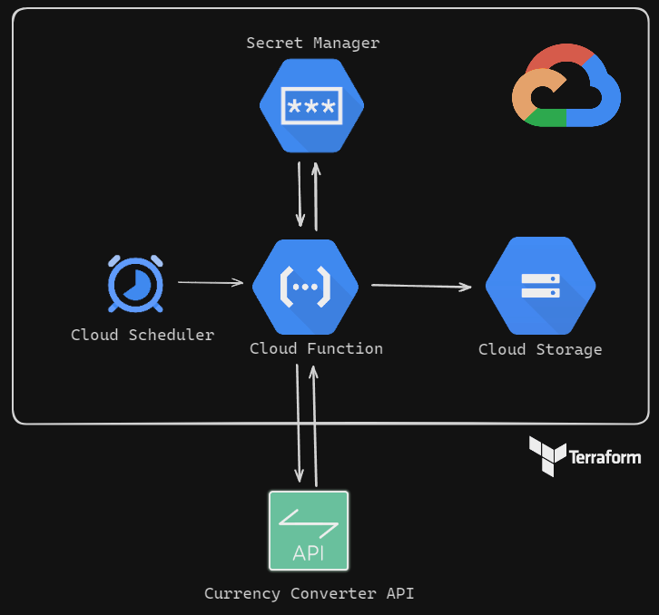
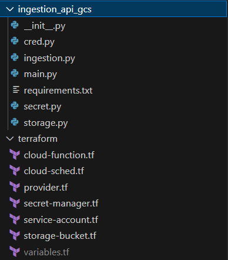

# Ingestão de Dados por API em ambiente Cloud (GCP) - Camada RAW

O objetivo deste projeto é desenvolver uma automação que colete dados relacionado as moedas por meio de uma API e armazene esses dados em uma camada raw, visando uma evolução para aspectos analíticos (será explorado nos futuros projetos). 

A API que iremos utilizar será a [Free Currency Conversion API](https://freecurrencyapi.com). Essa API é privada (ou seja, será necessário cadastro de uma conta), mas possui 5k requisições gratuitas por mês, envolvendo mais de 32 moedas e tendo atualização diária.

Devemos, diariamente, verificar o valor do REAL BRASILEIRO perante as outras 31 moedas mundiais. Vamos visar que nos futuros projetos desejamos ter uma área analítica para desenvolvimento de paínes para análises relacionados aos aspectos financeiros do Brasil. Por isso, precisamos inicialmente coletar esses dados e armazenar na camada RAW dentro de um Cloud Storage na nuvem da Google Cloud.

Será utilizado Cloud Functions como local de execução do código, que será desenvolvido em Python, seguindo os princípios da programação orientada a objetos (POO) e as melhores práticas de programação.

O gatilho de execução será configurado por meio do Cloud Scheduler. Toda a infraestrutura será provisionada utilizando o Terraform, que permite a criação da infraestrutura como código. 

## Tecnologias Utilizadas
- Python: Linguagem de programação utilizada para o desenvolvimento da pipeline.
- Cloud Functions: O ambiente na nuvem que executará o código Python, fornecendo escalabilidade e flexibilidade.
- Cloud Storage: Um ambiente na nuvem que permitirá armazenar os arquivos JSON, incluindo as respostas da API de forma segura e escalável.
- Cloud Scheduler: Uma ferramenta na nuvem que permite agendar a execução das Cloud Functions, possibilitando automação e programação de tarefas.
- Secret Manager: A ferramenta que irá auxiliar no armazenamento de dados sensíveis, como tokens.
- Terraform: Uma ferramenta que possibilita a provisionamento eficiente de toda a infraestrutura necessária, seguindo a metodologia de infraestrutura como código (IaC).

## Arquitetura


## Estrutura de pastas

- `ingestion_api_gcs` essa pasta contém o código-fonte da função `cloud function` que sera exportado para a nuvem.
- `terraform` pasta com as configurações e provisionamento da infraestrutura do projeto na nuvem.



## [Ingestão dos dados](ingestion_api_gcs/ingestion.py)

A ingestão dos dados é feita por meio da classe `Ingestion` que é uma especialização da classe `ApiCurrencyRequests` que fornece métodos específicos para acessar endpoints da API [Free Currency](https://freecurrencyapi.com). Em essência, essa classe facilita a ingestão de dados relacionados a moedas, taxas de câmbio e históricos de variação cambial.

> [!IMPORTANT]
> Na classe `ApiCurrencyRequests` existe a função `headers` ela é essencial para definir os cabeçalhos HTTP. 
> Que autenticam e configuram corretamente as requisições à API. 
> Estes cabeçalhos contêm informações críticas que afetam o comportamento da API em relação ao cliente.

### Principais Responsabilidades e Métodos

### 1. Inicialização (`__init__`)
- A classe é inicializada com um `token` de autenticação para a API e um `endpoint` que define a URL base (por padrão, `'https://api.freecurrencyapi.com/v1'`).
- Ela chama o construtor da classe pai (`ApiCurrencyRequests`) para configurar esses parâmetros e preparar os cabeçalhos da requisição.

### 2. Métodos para Acessar Dados

- **`status`**: 
  - Retorna o status da API, útil para verificar se a API está operacional.
  - Faz uma requisição ao endpoint `/status`.

- **`lista_moedas`**: 
  - Lista as moedas disponíveis na API.
  - Opcionalmente, você pode filtrar por moedas específicas, passando uma lista de códigos de moedas (por exemplo, `['USD', 'EUR']`).
  - Utiliza o endpoint `/currencies`.

- **`taxa_cambio`**: 
  - Obtém as taxas de câmbio mais recentes com base em uma moeda específica (`base_currency`).
  - Também permite listar moedas específicas para comparar taxas.
  - Faz uma requisição ao endpoint `/latest`.

- **`historico`**: 
  - Retorna o histórico de taxas de câmbio para uma data específica (`date`).
  - Você pode especificar uma moeda base e uma lista de moedas para filtrar os dados.
  - Esse método faz uma requisição ao endpoint `/historical`.

### 3. Método Auxiliar

- **`list_join`**: 
  - Converte uma lista de moedas (por exemplo, `['USD', 'EUR']`) em uma string separada por vírgulas (`'USD,EUR'`).
  - Isso é útil para construir os parâmetros de consulta necessários para as requisições da API.

### Exemplo de Uso

Com a classe `Ingestion`, você pode facilmente obter informações de câmbio e manipular esses dados de forma programática. Por exemplo:

```python
# Criando uma instância da classe
api_ingestion = Ingestion(token='seu_token_api')

# Obtendo o status da API
status = api_ingestion.status

# Listando moedas
moedas = api_ingestion.lista_moedas(['USD', 'EUR', 'BRL'])

# Obtendo taxas de câmbio mais recentes para USD
taxas = api_ingestion.taxa_cambio(base_currency='USD', currencies=['EUR', 'BRL'])

# Consultando o histórico de câmbio para uma data específica
historico = api_ingestion.historico(date=datetime(2023, 1, 1), base_currency='USD', currencies=['EUR'])
```

## [Acessando segredos](ingestion_api_gcs/secret.py)

Para acessar a API precisamos de um token. Esse token é fornecido logo após o cadastro feito na plataforma [Free Currency](https://freecurrencyapi.com).
Como se trata de um dado sensível precisamos acessar e armazenar o token de forma segura, com verificações de integridade e garantia de que os valores lidos não sejam corrompidos ou comprometidos.

A classe `Secret` permite acessar de forma segura segredos armazenados no Google Cloud Secret Manager. Essa classe é útil para recuperar informações confidenciais, como tokens de API, chaves e outras credenciais, usando a biblioteca Python do Google Cloud. Tanto o token de acesso da API como as credenciais da conta de serviço, foram armazenadas no Secret Manager, garantindo uma camada extra de segurança, já que ambos os dados sensíveis estão protegidos.

### Funcionalidades

- **Acesso seguro:** Verificação de integridade dos dados usando CRC32C para garantir que o valor do segredo não foi corrompido durante a transferência.
- **Extensível:** A classe herda de `Cred`, permitindo flexibilidade na configuração de clientes personalizados ou credenciais.
- **Fácil de usar:** Recupera o valor do segredo em texto puro, pronto para uso.

### Exemplo de Uso

Para acessar um segredo armazenado no Google Cloud Secret Manager, basta instanciar a classe `Secret` com o `project_id`, `secret_id`, e a `version_id` do segredo (a versão é opcional e, por padrão, é definida como `1`). O exemplo abaixo demonstra como recuperar o valor de um segredo:

```python
# Importa a classe Secret do módulo onde ela está definida
from secret import Secret

# Define os parâmetros do projeto e do segredo
project_id = 'project_id'
secret_id = 'secret_id'

# Instancia a classe Secret com o ID do projeto e o ID do segredo
secret_client = Secret(project_id=project_id, secret_id=secret_id)

# Recupera o valor do segredo
secret_value = secret_client.access_secret_version()

# Exibe o valor do segredo
print(secret_value)
```

## [Armazenar](ingestion_api_gcs/storage.py)

O objetivo do projeto é armazenar os arquivos `.json` provenientes da API, em um bucket do Google Cloud Storage dentro de uma camanda `raw` diariamente. A classe `Storage` facilita a interação com o Google Cloud Storage, permitindo fazer upload de dados JSON diretamente da memória para um bucket. A classe herda de `Cred`, possibilitando a configuração flexível do cliente e das credenciais.

### Funcionalidades

- **Upload de JSON em Memória**: Realiza upload de dados JSON diretamente da memória para um bucket no Google Cloud Storage.
- **Extensível**: Como herda de `Cred`, a classe permite configurar clientes personalizados e usar credenciais armazenadas de maneira segura, como as recuperadas do Secret Manager.

### Exemplo de Uso

Para fazer o upload de um arquivo JSON diretamente da memória para o Google Cloud Storage, siga o exemplo abaixo:

```python
# Importa a classe Storage do módulo onde ela está definida
from storage import Storage

# Define os dados JSON a serem enviados
data = {
    "name": "example",
    "description": "This is a JSON upload example"
}

# Define o nome do bucket e o caminho do blob
bucket_name = 'bucket-name'
blob_name = 'file/blob.json'

# Instancia a classe Storage
storage_client = Storage()

# Realiza o upload do JSON
blob = storage_client.upload_json_memory(data, bucket_name, blob_name)

# Confirma o local de armazenamento do JSON
print(f"JSON uploaded to: gs://{bucket_name}/{blob_name}")
```

> [!IMPORTANT]
> A classe `Cred` desempenha um papel fundamental em ambas as classes `Storage` e `Secret` porque ela centraliza a gestão de autenticação
> e credenciais ao interagir com os serviços da Google Cloud, como o Secret Manager e o Cloud Storage. 
> Essa classe encapsula a lógica de como as credenciais são gerenciadas e utilizadas para criar clientes autenticados, 
> garantindo que as operações realizadas nesses serviços sejam seguras e que o código permaneça limpo e reutilizável.

## [Infraestrutura - Terraform](terraform)

Toda a infraestrutura do projeto em nuvem, foi configurado e gerenciado pelo terraform. O Terraform é uma ferramenta de código aberto que permite criar, alterar e versionar infraestrutura de nuvem de forma segura e eficiente. Ela é uma das ferramentas de IaC (Infrastructure-as-Code) mais populares e é usada para gerenciar infraestrutura em nuvens públicas, privadas e serviços SaaS.

### Recursos implatados com o terraform

Os recusros necessarios para criar o projeto são: Cloud Storage, Secret Manager, Service Account, Scheduler Jobs e Cloud Fuction. Abaixo uma explicação sobre cada arquivo criado e usado pelo terraform para a criação do ambiente em nuvem.

- `variables.tf` é usado para definir variáveis que podem ser utilizadas na configuração. Ele torna a infraestrutura mais flexível e reutilizável, separando os valores das configurações.

```terraform
variable "project_id" {
  type    = string
  default = "valor-projeto"
}

variable "region" {
  type    = string
  default = "valor-region"
}

variable "bucket_name" {
  type    = string
  default = "valor-bucket-name"
}

variable "id_secret" {
  type    = string
  default = "valor-segredo-api"
}

variable "id_secret_json" {
  type    = string
  default = "valor-segredo-credenciais"
}

variable "default_key" {
  type    = string
  default = "valor-chave-api"
}
```

- `provider.tf` Para declarar a conexão com o provedor do Google no Terraform, você precisa especificar o bloco provider no seu arquivo de configuração do Terraform

> [!WARNING]
> Para usar o terraform com o Google Cloud, antes é preciso instalar e configurar o [gcloud CLI](https://cloud.google.com/sdk/docs/install?hl=pt-br)
> e configurar a autenticacão no terminal com o comando: 
> ```
> gcloud auth aplicativo-default login
> ```

```terraform

terraform {
  required_providers {
    google = {
      source  = "hashicorp/google"
      version = "6.6.0"
    }
  }
}

provider "google" {
  project = var.project_id
  region  = var.region
}
```

- `service-account.tf` todo o projeto sera vinculado a uma única conta de serviço, o arquivo cria a conta, adiciona uma chave e exporta a mesma para um arquivo .json que sera usada pelos outros serviços.

```terraform
resource "google_service_account" "bucket_account" {
  account_id   = "${var.bucket_name}-${var.project_id}"
  display_name = "trabalho api currency"
}

resource "google_service_account_key" "bucket_account_key" {
  service_account_id = google_service_account.bucket_account.name
  public_key_type    = "TYPE_X509_PEM_FILE"
  private_key_type   = "TYPE_GOOGLE_CREDENTIALS_FILE"
}

resource "local_file" "bucket_account_key_file" {
  content  = base64decode(google_service_account_key.bucket_account_key.private_key)
  filename = "${path.module}/service_account_key.json"
}
```

- `secret-manager.tf` cria os segredos para armazenar com segurança, o token da API e a chave com as credencials de acesso da conta de serviço. Assim como da a permissão de acesso a conta de serviço aos segredos.

```terraform
resource "google_secret_manager_secret" "segredo" {
  project   = var.project_id
  secret_id = var.id_secret

  replication {
    auto {}
  }
}

resource "google_secret_manager_secret_version" "segredo_version" {
  secret      = google_secret_manager_secret.segredo.id
  secret_data = var.default_key
}

resource "google_secret_manager_secret_iam_member" "segredo_access" {
  secret_id = google_secret_manager_secret.segredo.secret_id
  role      = "roles/secretmanager.secretAccessor"
  member    = "serviceAccount:${google_service_account.bucket_account.email}"
}

resource "google_secret_manager_secret" "key_account" {
  project   = var.project_id
  secret_id = var.id_secret_json

  replication {
    auto {}
  }
}

resource "google_secret_manager_secret_version" "key_account_version" {
  secret      = google_secret_manager_secret.key_account.id
  secret_data = base64decode(google_service_account_key.bucket_account_key.private_key)
}

resource "google_secret_manager_secret_iam_member" "key_account_access" {
  secret_id = google_secret_manager_secret.key_account.secret_id
  role      = "roles/secretmanager.secretAccessor"
  member    = "serviceAccount:${google_service_account.bucket_account.email}"
}
```

- `storage-bucket.tf` são criados dois buckets um para armazenar os dados da API e outro para guardar o código fonte Python da Cloud Function. A permissão de admin é concedida para a conta de serviço ao bucket referente aos dados da API.

```terraform
resource "google_storage_bucket" "storage_api" {
  name          = var.bucket_name
  location      = var.region
  project       = var.project_id
  force_destroy = true

  storage_class            = "STANDARD"
  public_access_prevention = "enforced"
}

resource "google_storage_bucket" "function_api" {
  name          = "${var.bucket_name}-function"
  location      = var.region
  project       = var.project_id
  force_destroy = true

  public_access_prevention = "enforced"
}

resource "google_storage_bucket_iam_member" "bucket_access" {
  bucket = google_storage_bucket.storage_api.name
  role   = "roles/storage.admin"
  member = "serviceAccount:${google_service_account.bucket_account.email}"
}
```

- `cloud-function.tf` provisiona a Cloud Function onde o gatilho é um requisição HTTP. Começa criando um arquivo ZIP com o codigo fonte Python da função em nuvem, depois exporta para o bucket especializado para armazenar o codigo associado a função. A Cloud Function é criada com base no arquivo ZIP e associada a conta de serviço que é compartilhada entre todos os recursos. Algumas variáveis de ambiente são adicionadas, pois serão utilizadas para executar a função. Também é concedido a conta de serviço permissão para invocar a função.

```terraform
data "archive_file" "source" {
  type        = "zip"
  source_dir  = "../ingestion_api_gcs"
  output_path = "${path.module}/function.zip"
}

resource "google_storage_bucket_object" "zip" {
  source       = data.archive_file.source.output_path
  content_type = "application/zip"
  name         = "src-${data.archive_file.source.output_md5}.zip"
  bucket       = google_storage_bucket.function_api.name
  depends_on = [
    google_storage_bucket.function_api,
    data.archive_file.source
  ]
}

resource "google_cloudfunctions_function" "Cloud_function" {
  name                  = "${var.bucket_name}-cloud-function"
  description           = "trabalho api currency"
  runtime               = "python311"
  project               = var.project_id
  region                = var.region
  source_archive_bucket = google_storage_bucket.function_api.name
  source_archive_object = google_storage_bucket_object.zip.name
  trigger_http          = true
  entry_point           = "insert_json"
  service_account_email = google_service_account.bucket_account.email

  environment_variables = {
    project_id     = "${var.project_id}"
    secret_id      = "${var.id_secret}"
    bucket_name    = "${var.bucket_name}"
    secret_id_json = "${var.id_secret_json}"
  }

  depends_on = [
    google_storage_bucket.function_api,
    google_storage_bucket_object.zip,
  ]
}

resource "google_cloudfunctions_function_iam_member" "invoker" {
  project        = google_cloudfunctions_function.Cloud_function.project
  region         = google_cloudfunctions_function.Cloud_function.region
  cloud_function = google_cloudfunctions_function.Cloud_function.name

  role   = "roles/cloudfunctions.invoker"
  member = "serviceAccount:${google_service_account.bucket_account.email}"

  depends_on = [
    google_cloudfunctions_function.Cloud_function,
    google_service_account.bucket_account,
  ]
}
```

- `cloud-sched.tf` essa configuração cria um job no Cloud Scheduler que invoca a função do Google Cloud diariamente às 6:00 AM, utilizando autenticação OIDC com a conta de serviço associada a todos os outros recursos.

```terraform
resource "google_cloud_scheduler_job" "job" {
  name             = "${var.bucket_name}-job"
  project          = var.project_id
  region           = var.region
  description      = "trabalho api currency"
  schedule         = "0 6 * * *"
  time_zone        = "America/Fortaleza"
  attempt_deadline = "320s"

  http_target {
    http_method = "POST"
    uri         = google_cloudfunctions_function.Cloud_function.https_trigger_url

    oidc_token {
      service_account_email = google_service_account.bucket_account.email
    }
  }

  depends_on = [
    google_cloudfunctions_function.Cloud_function,
    google_service_account.bucket_account
  ]
}
```

### Deploy da infraestrutura

Para iniciar o processo de deploy com o terraform é preciso entrar na pasta com os arquivos do terraform. O primeiro comando a ser executado é o `terraform init` que baixa todos os provedores e plugins necessários.

> [!NOTE]
> Segue link de instalação do [terraform](https://developer.hashicorp.com/terraform/tutorials/aws-get-started/install-cli)

```bash
> terraform init
> terraform fmt
> terraform validate
> terraform plan
> terraform apply -auto-approve
```